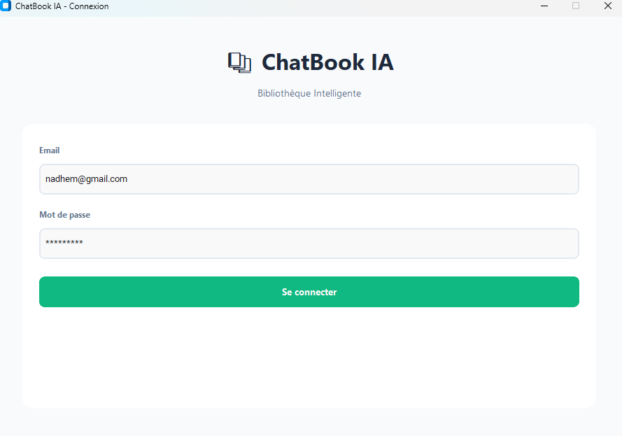
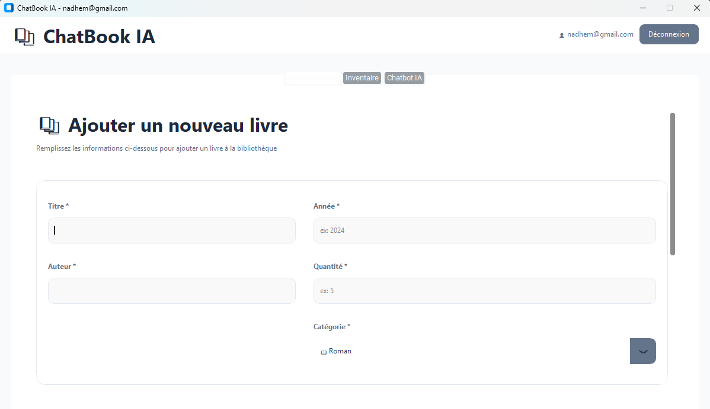
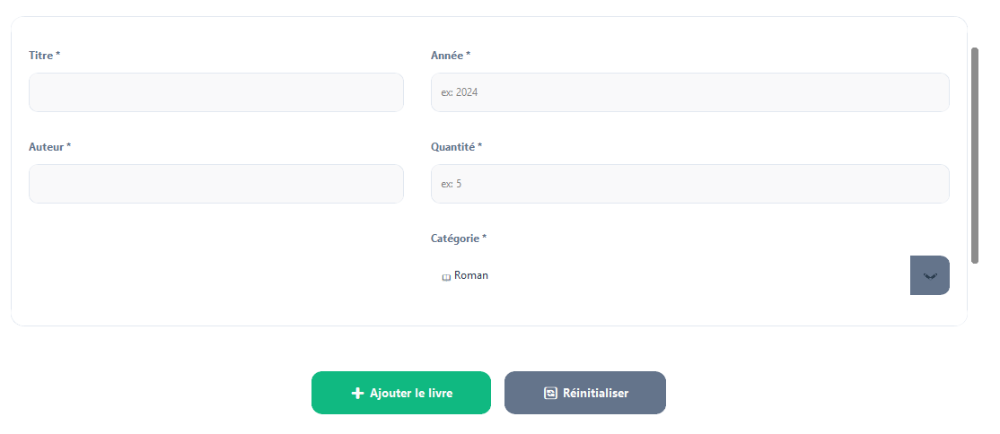
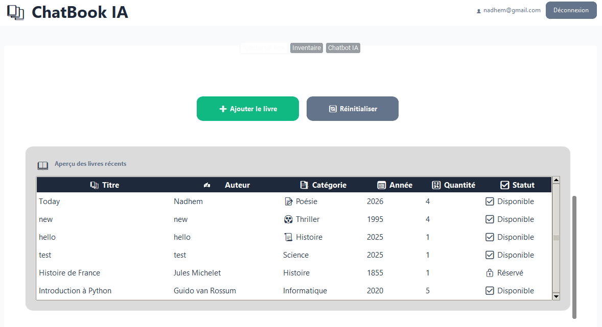
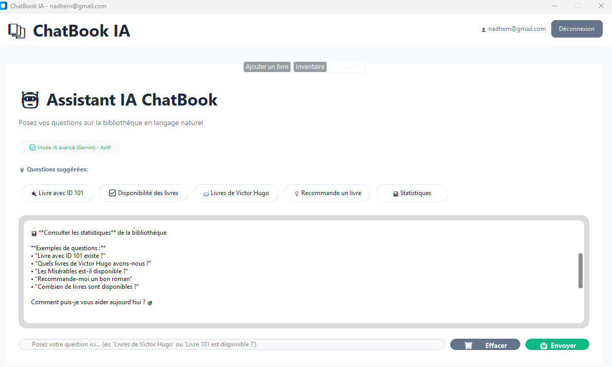

# ChatBook IA

**ChatBook IA** est une application desktop (Python + Tkinter/CustomTkinter) qui gère une **bibliothèque de livres** (CRUD via fichier CSV) et propose un **assistant IA** pour répondre sur les livres disponibles.

---

## Fonctionnalités

- **Connexion** des utilisateurs (authentification via `data/users.csv`)
- **Ajouter / modifier / supprimer des livres** (stockage dans `data/books.csv`)
- **Inventaire / liste des livres** dans une vue dédiée
- **Chatbot IA** pour poser des questions sur le catalogue
- **Interface moderne** (CustomTkinter) avec thèmes/couleurs

---

## Aperçu des écrans (à compléter avec vos captures)

> Ajoutez vos captures d’écran dans cette section.

### 1) Écran de connexion



### 2) Écran principal / navigation



### 3) Ajouter un livre



### 4) Inventaire



### 5) Chatbot IA



---

## Prérequis

- Python 3.10+ (le projet a été testé avec Python récent)
- Un compte et une **clé API** pour le service IA (Google Gemini)

---

## Installation

### 1) Cloner / ouvrir le projet

Ouvrez le dossier `chatbook-ia`.

### 2) Installer les dépendances

Dans le dossier du projet :

```bash
pip install -r requirements.txt
```

### 3) Configurer la clé API (Gemini)

1. Créez (ou modifiez) un fichier `.env` à la racine du projet.
2. Ajoutez :

```env
GEMINI_API_KEY=VOTRE_CLE_API
```

---

## Lancer l’application

```bash
python main.py
```

---

## Structure du projet (vue d’ensemble)

- `main.py` : point d’entrée de l’application
- `src/views/` : écrans Tkinter/CustomTkinter (login, main, add book, inventory, chatbot)
- `src/services/` : logique métier (auth, books, chatbot)
- `src/models/` : modèles (Book, User)
- `src/database/` : gestion CSV (`books.csv`, `users.csv`)
- `src/config/` : configuration (couleurs, chemins, clé API)
- `data/` : fichiers CSV de données

---

## Notes importantes

- Les données sont stockées dans `data/books.csv` et `data/users.csv`.
- Si vous voyez une erreur liée au modèle IA (Gemini), vérifiez :
  - votre `GEMINI_API_KEY`
  - le modèle défini dans `src/config/settings.py`

---

## Auteur

Projet réalisé pour ChatBook IA.
